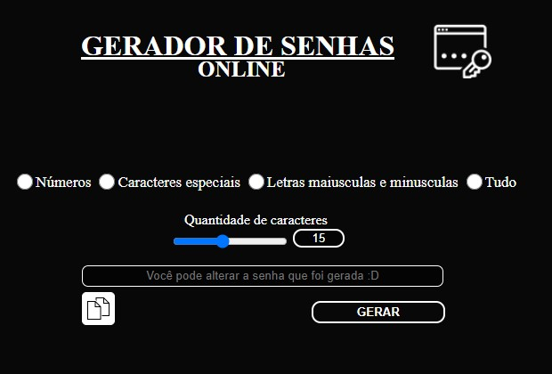

# Password-Generator-Gerador-de-Senhas
Um projeto simples de gerar senhas aleatórias feito com JS.

<b><kbd>Português</kbd></b>

<b>GERADOR DE SENHAS</b>

Descrição do projeto:

Um projeto simples que gera senhas aleatórias e as classifica como forte, média, fraca ou muito fraca por meio das cores: vermelho, branco, amarelo e verde. 
Ele permite escolher quantos caracteres você quer que sua senha possua, e se você quer somente números, letras, letras + caracteres especiais ou tudo junto, além disto permite que você altere o que está escrito na senha, caso queira colocar uma palavra e logo após a senha que foi gerada. O projeto contém um botão para copiar a senha para a área de Transferência.

<b>Linguagens e ferramentas:</b> 
 &nbsp;
 &nbsp;
 &nbsp;
 &nbsp;
  <b>Foto do projeto:</b> 

<b><kbd>English</kbd></b>

<b>PASSWORD GENERATOR</b>

Project description:

A simple project that generates random passwords and how it classifies as strong, medium, weak or very weak by colors: red, white, yellow and green. 
It allows you to choose how many characters you want your password to have, and if you want only numbers, letters, letters + special characters or everything together, it also allows you to change what is written in the password, if you want to enter a word and then the password that was generated. The project contains a button to copy the password to the clipboard.

<b>Languages and Tools:</b> 
 &nbsp;
 &nbsp;
 &nbsp;
 &nbsp;

  <b>Project photo:</b> 

